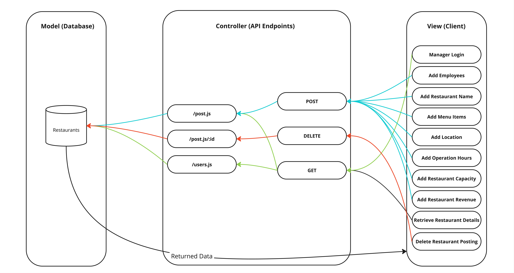

# Group Members
Kyle Du, James Parrott, Daphni Ann George, Ashwin Subramanian, Luis Gabriel Cainglet

# Project Description
## Target Audience
The target audience for our platform is restaurant owners who own multiple locations. Our vision for this application is to offer a service that tracks employees and their pay, menu items, prices, hours of operation, location, supply needs, revenue, and expenditure. This centralized hub of information will help owners track how well their restaurants are performing and their day-to-day needs. This will result in owners making more informed business decisions as they can better track their restaurant's performance. Owners will be able to easily find out what “needs” their location requires and any operational changes to improve revenue. 

Additionally, this application will help restaurant owners who own multiple locations to organize business documents for each location. Since they will be able to store information regarding employees, revenue, and expenditures owners will be able to quickly associate relevant business documents to the correct location. This will help streamline employee management and payroll. Using this service restaurant owners will have an easier time understanding their revenue and supply needs. Furthermore, owners will have an easier time managing their paperwork and employee payroll via our application.

## Why does your audience want to use your application?
Restaurant owners with multiple locations will want to use our application because it will help them organize their information. Owners will no longer need to have a filing cabinet with multiple folders that store all of their relevant documents. They will be able to use our application to help determine their restaurant's supply needs, profitability status, and employee management. This application will reduce the time it takes to manage these tasks. Owners will be able to spend more time optimizing their restaurant's revenue and improving customer satisfaction. Being able to spend more time focusing on these two aspects will help create a loyal customer base ensuring business stability and success.

## Why do you as developers want to build this application?
While none of us own a restaurant or have had experience with managing a restaurant, we all recognize having a clear and organized hub of information is vital to succeeding academically and professionally. Being able to quickly find information is key to success as you’re able to quickly respond to new requirements. Developing this application will help us better understand how we should organize and display key information. This project will allow us to apply essential lessons, concepts, and design practices that will be valuable in our future industry work.

Furthermore, we want to build this application to have a technical project that we can place on our resumes. We want to show recruiters that we understand how to design and architect web applications.  Additionally, we want to our technical understanding of API calls, database management, and user authentication and authorization. Being able to show that we understand these concepts will help make us more interesting applicants for our future roles.

Overall we want to develop this application in order to have a better understanding of how to display and format information via a website. Having this understanding will help prepare us for future industrial roles and projects. Additionally, we want to work on this application to refine and improve key skills required for software engineering positions. This will help make us more desirable applicants as we will have an understanding of how to design and launch a website.

# Technical Description

## Architectural Diagram

## Dataflow Diagram

## User Story Summary Table
| Priority | User | Description | Technical Implementation |
| ---- | ---------- |-------------------- | -------------------------- |
| P0 | As a owner | I want to be able to login into my restaurant account | Use Azure to authenticate restaurant managers |
| P0 | As a owner | I want to see a restaurant "box" after uploading my restaurant to access and modify its attributes. | Display a clickable restaurant card that fetches stored details from MongoDB. |
| P0 | As a owner | I want to modify my restaurant’s details at any time. | Retrieve the restaurant's data and allow updates in MongoDB. |
| P1 | As a owner | I want to upload and organize business documents by location | Implement file upload and associate documents with restaurant locations. |
| P1 | As a owner | I want to add and manage employees. | Store and modify employee details in MongoDB. |
| P1 | As a owner | I want to track restaurant revenue over time. | Store revenue data in MongoDB and allow updates |
| P2 | As a owner | I want to view analytics on my restaurant's performance | Aggregate and present data in a structured format for review. |

## API Endpoints
1. **GET** /user/login --> Enables the restaurant managers to log into their accounts.
2. **GET** /restaurant/overview --> Enables the restaurant managers to retrieve the compiled information of their restaurants.
3. **POST** /restaurant/employee-details --> Enables managers to add employees.
4. **POST** /restaurant/restaurant-name --> Enables managers to add a name for their restaurant(s).
5. **POST** /restaurant/menu-items --> Enables managers to add menu items in their restaurant(s).
6. **POST** /restaurant/location --> Enables managers to add the location details of their restaurant(s).
7. **POST** /restaurant/operation-times --> Enables managers to add the hours of operation of their restaurant(s).
8. **POST** /restaurant/capacity --> Enables managers to add the customer capacity details of their restaurant(s).
9. **POST** /restaurant/revenue --> Enables managers to add the accumulated revenue of their restaurant(s).

## Database Schemas
